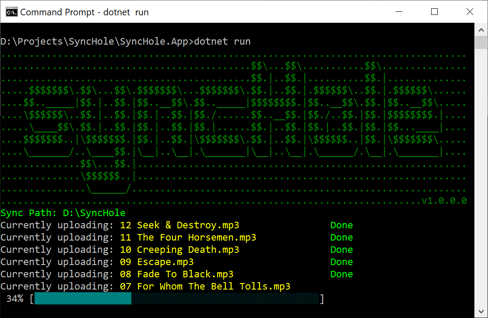

# SyncHole

If you are anything like me, you are hoarding huge amounts of data that you cringe at letting go. You know like everything from rare `mp3s` 🎧, music videos that once aired on MTV 📺, home movies 🏡, DSLR `raw` images 📸. The problem is that all this data-hoarding eats away at your precious local storage space. 

## SyncHole to the rescue!
SyncHole is a drop-in archive 📦 app. It monitors a sync-directory 🗃 to pick-up files and upload them to BYO cloud storage. Once the file is uploaded, it is deleted from your local storage to reclaim space. Don't worry, they are not gone forever. You can always recover them from the cloud storage.

### Features
1. Multipart chunk upload for background transfers
2. Resume functionality for interrupted files

## AWS S3 Glacier 
At the moment, only **AWS S3 Glacier** is supported, but you can add support for other cloud storage providers by implementing the `IStorageClient` interface. AWS Glacier ⛰ is a cheap data archival service that doesn't cost you an arm and a leg. You can upload the data right-away, but retrieval has some delay i.e., if you don't want to spend big bucks 💸. This type of delay is fine for archival purposes. You can read more about AWS Glacier [here](https://aws.amazon.com/glacier/).

## Configuration
SyncHole App reads the configuration from the `appsettings.json` file. Even though its pretty straight forward, let me just list the configuration properties here.

| Property                       | Description                                                                                                                                                                                    |
|--------------------------------|------------------------------------------------------------------------------------------------------------------------------------------------------------------------------------------------|
| AWSCredentials:AccessKeyId     | AWS IAM account key used for authentication. Read [here](https://www.freezeapp.net/guide/set-up-aws-credentials-and-connect-to-amazon-glacier/) how to generate a new IAM Account for Glacier. |
| AWSCredentials:AccessSecretKey | AWS IAM access secret key used for authentication. See more above.                                                                                                                             |
| AWSCredentials:ServiceEndpoint | The service endpoint indicating which data center location to use. See a list of endpoints [here](https://docs.aws.amazon.com/general/latest/gr/rande.html#glacier_region).                    |
| SyncOptions:SyncDirectory      | The directory to monitor for synchronization.                                                                                                                                                  |
| SyncOptions:SyncFilter         | File filter for querying files, e.g. `*.mp3`                                                                                                                                                   |
| SyncOptions:VaultNameFormat    | Creation date of files is used to create new archive vaults. Use this property to set the format e.g., `yyyy-MM-dd`.                                                                           |
| SyncOptions:IgnoreRegex        | Regular expression for ignoring certain files e.g., `^.*db$`.                                                                                                                                  |

## How to Run 🚀
SyncHole App is built as a generic aspnet host, which means it doesn't have Http services and is a bare-bone application host. You can run SyncHole App from the project directory using the `dotnet run` command. For creating portable execution package, follow these steps.

1. Run the restore command `dotnet restore`
2. Run the build command for compilation `dotnet build`
3. Publish to create the release package `dotnet publish`
4. Now locate the release folder and execute the app `dotnet .\SyncHole.App.dll`
